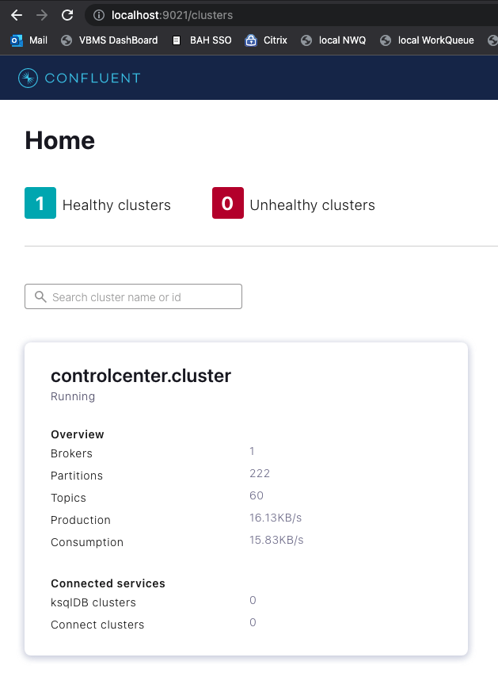
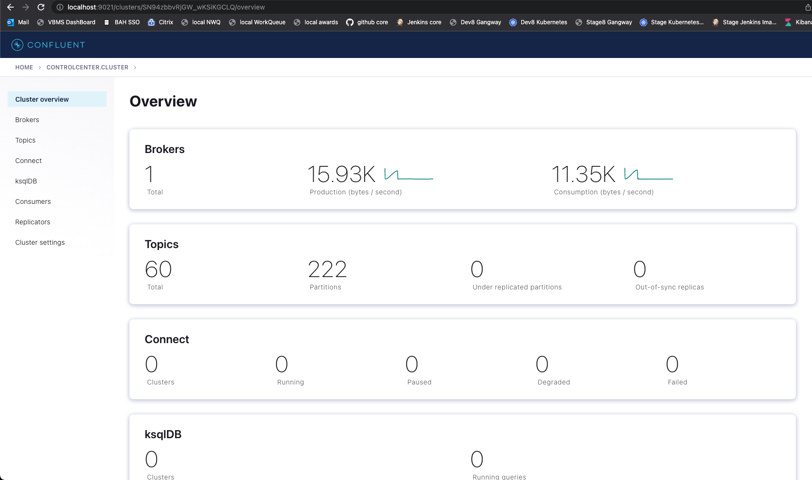
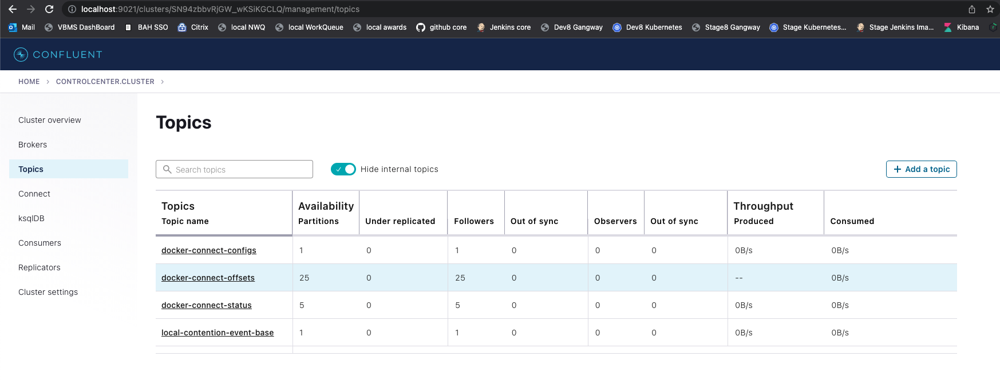
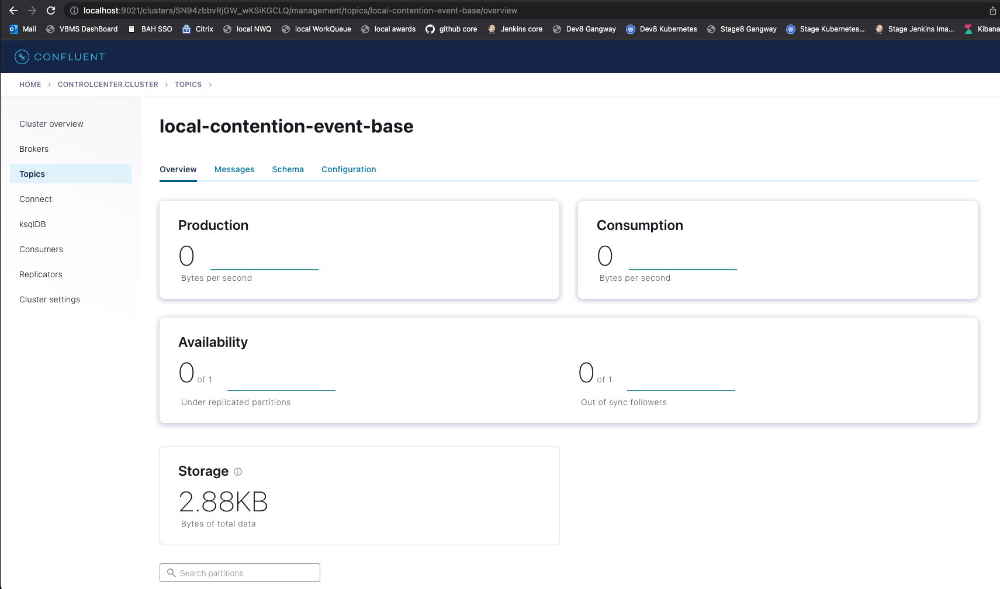
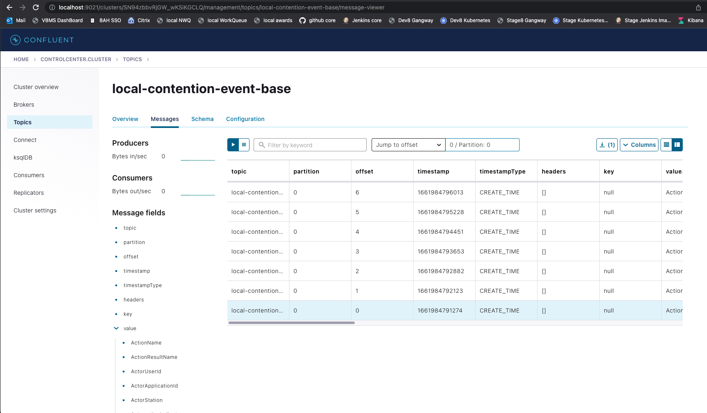
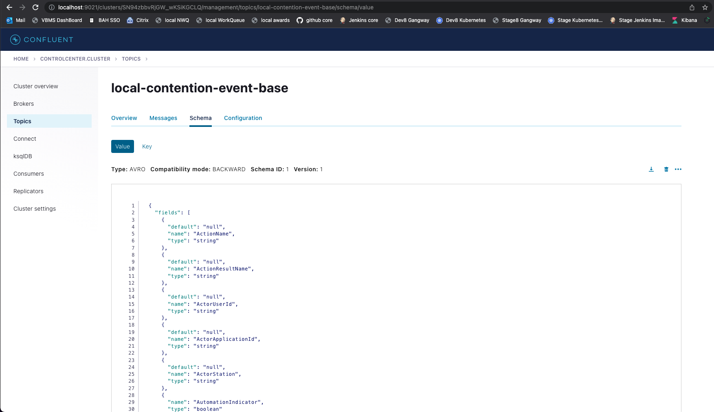

# SinkConnectorTesting

## Why would I use this? 
This repository was created to aid in testing Kafka sink connector configurations.  The current implementation is
based around a jdbc Oracle sink connector for ContentionEventBase.avsc messages.  The schema can be found [here](https://github.com/department-of-veterans-affairs/bip-bie-claim-contention-sp/blob/master/sp-app/src/main/resources/avro/helpers/ContentionEventBase.avsc)
as well as an internal copy [here](./schemas/ContentionEventBase.avsc).

Testing Kafka connector configurations is a heavy lift.  We need an entire local kafka environment, a topic, a 
schema loaded in schema registry, and avro messages being produced to the topic.  All this needs to take place just to 
test less than 30 lines of [sink connector configuration](./connectConfigs/sinkConnector.json).  So, hopefully this will
be useful to others that find themselves in a holding pattern waiting for topics to materialize.  This allows us to use 
the avro schema as a contract and work out the entire database portion (sink connector configuration and database 
structure). This will allow any work relying on the database data/structure to continue without impediment. 

This repository does the following:
- Sets up a local kafka environment in docker.  This includes:
  - ZooKeeper
  - Kafka
  - Confluent Command Center
  - Schema Registry
  - Kafka Connect
  - and a temp container to set up the single topic we are testing
- It also has shell scripts that:
  - read json files representing data for messages (not yet in avro format)
  - converts json payload to binary avro
  - registers schema in Schema Registry
  - produce avro messages to topic
  - set up a sink connector via http and connector config json
  - and convenience scripts to start and stop everything at once 

## Prerequisites
#### Docker
This testing suite makes heavy use of docker containers using docker-compose.
#### Command line tools 
There are some prerequisites for running these scripts.  If you are using a Mac and using Brew, you can run the 
[installMacPrereqs script](./shellScripts/installMacPrereqs.sh) to install all of them.  The command line tools are: 
- avro-tools
- jq
- kcat
#### Database
The whole point of Kafka sink connector is to off load the data somewhere (usually a database).  In this test, we are 
sinking the data into the local vbms database that is running in docker.  The ***connection.url***, ***connection.user***, 
and ***connection.password*** in the [sink configuration](./connectConfigs/sinkConnector.json) is already setup for the 
local VBMS DB.  However, we still need to create a table that matches the [schema](./schemas/ContentionEventBase.avsc).    
That create table statement is [createContentionEventLatest.sql](./sql/createContentionEventLatest.sql)

## How to use
Once you have the prerequisites, all you need to do is run the [startAll script](./shellScripts/startAll.sh).    
The script will describe what it is doing in real time.  Once complete, you can check the output. 

## Verifying results
Once the [startAll script](./shellScripts/startAll.sh) is run, you can verify the results.  This is done in three 
places.
1. The [contentionBaseMessages](./contentionBaseMessages) folder in this repo contains json files that will be converted
to avro and published to the topic. 
2. The [c3 console](http://localhost:9021/) allows you to see messages in specific topics.  It also allows you to see 
the schema associated with the topic. 
3. The database table  where the data is getting written.    
In our case: `SELECT * FROM VBMSUI.CONTENTION_EVENT_LATEST;`

Using the above data, we can completely validate the functionality of our connector and make adjustments to the 
configuration as needed. 

## How to validate topics and schemas in Confluent Command Center (c3)
#### Navigate to the c3 Home page.  Click on ***controlcenter.cluster***

#### From the Overview page, click on ***Topics*** in the left navigation bar

#### On the ***Topics*** page, you will see all the active topics in Kafka.  Click on our topic: ***local-contention-event-base***

#### This is the topic overview.  From here, we can either ***Messages*** or ***Schema***   

#### If we clicked ***Messages***, we will see the messages.  Use the ***Jump to offset*** feature to find your messages.  For our purposes, an offset of 0 is perfect. 

#### If we clicked ***Schema***, we can review our schema to ensure it was added to the schema registry correctly.

## Shutting down kafka
Using the [stopAll script](./shellScripts/stopAll.sh) will shutdown the containers via docker-compose.

## Multiple Runs
The [startAll script](./shellScripts/startAll.sh) restarts everything in docker.  The only state held is in the database. 
You may want to truncate the table between runs depending on your use case. 

## Different sink connectors
This repo can be forked and adjusted for other sink connector types.  Please keep in mind that the volume mount in the 
connect contain may need to change based on your connector type.  Like wise the [jdbcConnect](./jdbcConnect) folder may 
also need updated.  Finally, the [sink connector configuration](./connectConfigs/sinkConnector.json) will need to be
updated as well. 

## Adjusting the json connector configuration for different environments
Keep in mind that different environments require different fields values in the connector configuration as things 
like db url change between environments.  Here is a list of know values that change for this config.  
- name
- topics 
- connection.url 
- connection.password 
- value.converter.schema.registry.url 
- value.converter.schemas.enable 
- key.converter.schema.registry.url

Your mileage may vary. 
